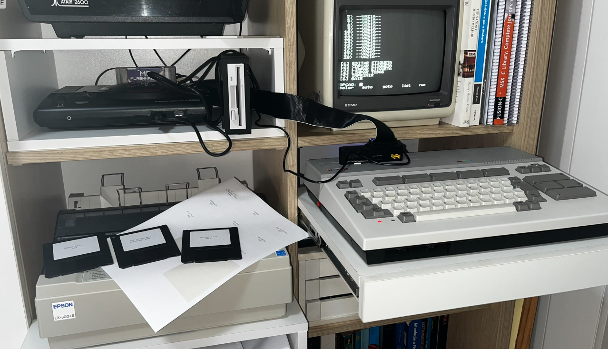
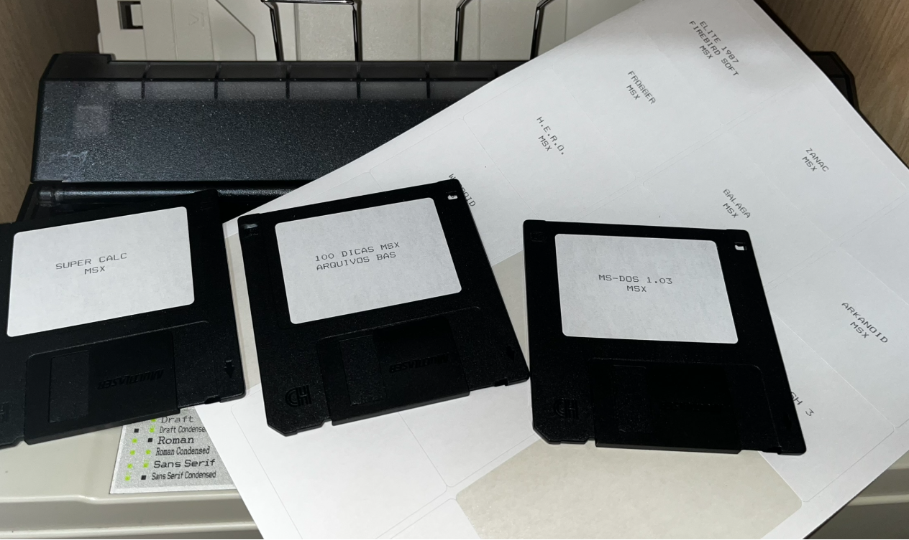

# ETIQUETA.BAS — Floppy Disk Label Printer for MSX

A menu-driven MSX BASIC program that prints a full sheet of 18 floppy disk labels (3 columns × 6 rows) on A4 paper using a dot-matrix printer compatible with the Epson ESC/P command set.

---

## Overview



*MSX HotBit computer connected to an Epson LX-300+II dot-matrix printer, with freshly printed label sheets and labeled 3.5" floppies.*

`ETIQUETA.BAS` was written and tested on an **MSX HotBit** computer with an **Epson LX-300** dot-matrix printer. It fills an entire A4 sheet with 18 labels arranged in a 3 × 6 grid, each label able to hold up to 3 lines of text. Text is automatically centered within each label area.

The program is entirely self-contained in MSX BASIC — no external libraries, no disk operating system required beyond what is needed to load and run the file.

---

## Results



*Labels printed and applied to 3.5" floppy disks. Titles visible include SUPER CALC, 100 DICAS MSX, MS-DOS 1.03, ELITE 1987, FROGGER, H.E.R.O., ZANAC, GALAGA, and ARKANOID — all for MSX.*

---

## Features

- **18 labels per sheet** — 3 columns × 6 rows, formatted for A4 paper
- **Up to 3 lines of text per label**, each up to 25 characters wide
- **Automatic horizontal centering** of each text line within its label cell
- **Interactive menu** for editing, copying, and clearing labels before printing
- **Flexible print selection** — print all 18 labels or specify individual labels and ranges (e.g. `1,3,5-8`)
- **Copy function** — duplicate one label's content to one or more destinations using the same range syntax
- **Epson LX-300 initialization** via ESC/P escape sequences (reset, 10 CPI Pica pitch, 1/6" line spacing)
- **Form feed** at end of print job to eject the page cleanly

---

## Layout Constants

The label grid geometry is defined in a single line at the top of the program and can be adjusted to fit different label sheets:

| Constant | Variable | Default | Meaning                          |
|----------|----------|---------|----------------------------------|
| Label width | `LW` | 25 | Characters per label (per column) |
| Label height | `LH` | 11 | Print lines per label row        |
| Text lines | `ML` | 3 | Editable text lines per label    |
| Number of labels | `NT` | 18 | Total labels on the sheet        |
| Left margin | `CM` | 3 | Spaces before the first column   |
| Column gap | `GC` | 1 | Spaces between columns           |
| Top margin | `TM` | 2 | Blank lines before first row     |

---

## Menu

```
==========================
   IMPRESSAO ETIQUETAS
    3x6 - A4 - LX-300
==========================

 1) --VAZIA--
 2) SUPER CALC
...

[1] EDITAR ETIQUETA
[2] COPIAR ETIQUETA
[3] LIMPAR ETIQUETA
[4] LIMPAR TODAS
[5] IMPRIMIR
[6] SAIR
```

### Options

| Key | Action |
|-----|--------|
| `1` | Edit a label — enter up to 3 lines of text for a chosen slot (1–18). Pressing ENTER on a line keeps the existing content. |
| `2` | Copy a label — duplicate one label's text to one or more destinations using comma/range notation (e.g. `2,3,5-8`). |
| `3` | Clear a single label slot. |
| `4` | Clear all 18 labels (asks for confirmation). |
| `5` | Print — choose between printing all labels or a custom selection. |
| `6` | Exit the program. |

The main screen always shows a preview list of all 18 slots, displaying the first 14 characters of line 1 (or `--VAZIA--` if empty).

---

## Printing

Selecting option `[5]` opens a sub-menu:

```
[1] IMPRIMIR TODAS
[2] IMPRIMIR SELECAO
[0] CANCELAR
```

- **Print all** marks every slot for printing.
- **Print selection** accepts a comma-and-range string such as `1,4,7-12,18`. Unselected slots are printed as blank label areas, preserving the grid alignment on the sheet.

The program then prompts you to connect the printer and insert an A4 sheet before sending data. Printer initialization is performed via ESC/P sequences (`ESC @` reset, `ESC P` 10 CPI, `ESC 2` 1/6" line spacing) to ensure consistent output regardless of the printer's power-on defaults.

---

## Requirements

- Any **MSX computer** with MSX BASIC
- A dot-matrix printer supporting **Epson ESC/P** commands connected to the MSX parallel port (`LPRINT` interface)
- **A4 label sheets** arranged in a 3 × 6 grid (or plain A4 paper for testing)
- Approximately **4 KB of free string memory** (`CLEAR 4000` is issued at startup)

Tested on:
- **Computer:** MSX HotBit (Sharp/Gradiente, Brazil)
- **Printer:** Epson LX-300 / LX-300+II

---

## How to Run

1. Load the file into MSX BASIC:
   ```
   LOAD "ETIQUETA.BAS"
   ```
2. Run it:
   ```
   RUN
   ```
3. Use the menu to fill in your label texts and then print.

If you are using a disk interface (e.g. MSX-DOS or a Flash cartridge), make sure the file is accessible on the current drive/directory before issuing `LOAD`.

---

## Program Structure

| Line range | Description |
|------------|-------------|
| 10–130 | Initialization — screen setup, constants, array allocation |
| 140–410 | Main menu loop |
| 500–580 | Subroutine: list all label slots on screen |
| 600–780 | Subroutine: edit a label |
| 800–930 | Subroutine: copy a label to destinations |
| 960–1070 | Subroutine: clear a single label |
| 1080–1180 | Subroutine: clear all labels |
| 1200–1680 | Subroutine: print (ESC/P init, row/column loop, centering) |
| 1800–1960 | Subroutine: parse copy destination string (comma + range syntax) |
| 2000–2230 | Subroutine: parse print selection string |

---

## License

This project is released to the public domain. Do whatever you like with it — hack it, port it, load it on real iron, share it with fellow retro-computing enthusiasts.

---

*Written in MSX BASIC • Tested on real hardware • No emulator required (but WebMSX works too)*
